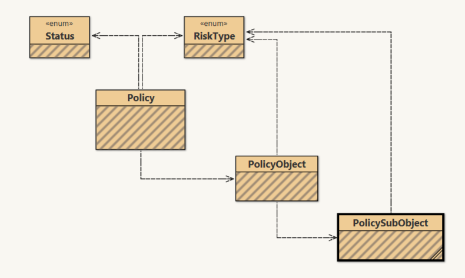

# Implementation

The project uses five classes. All classes are **immutable**. No Nulls allowed. No DTO classes or services. 

Graphical representation of dependencies in the diagram.



## Enum class RiskType

The enum class RiskType contains not only the constants but also all coefficients and formulas to correctly calculate premium for each particular type of risk. 

To extend implementation in the simplest case you need to add just one line of code with the name of new risk type and default coefficient in the list of enum class constants. 

For example, the following code will add implementation fot new risk type of floodwater with default coefficient 0.0165:
```
FLOODWATER("0.0165")
```
In the case if new risk type has several coefficients depending on the sum insured or has more complex formula you need to override the default method `BigDecimal getPremium(BigDecimal sumInsured)`. There is an example for the more complex case of new risk type.

```
EARTHQUAKE("0.01")  {
   private final BigDecimal caseOneSum = new BigDecimal("10000");
   private final BigDecimal caseTwoSum = new BigDecimal("1000000");
   private final BigDecimal caseOneCoefficient = new BigDecimal("0.0075");
   private final BigDecimal caseTwoCoefficient = new BigDecimal("0.0045");

   @Override
   BigDecimal getPremium(BigDecimal sumInsured) {
       final BigDecimal premium;

       if (sumInsured.compareTo(caseTwoSum) > 0) {
           premium = sumInsured.multiply(caseTwoCoefficient);
       } else if (sumInsured.compareTo(caseOneSum) > 0) {
           premium = sumInsured.multiply(caseOneCoefficient);
       } else {
           premium = sumInsured.multiply(defaultCoefficient);
       }
       return premium.setScale(scale, rounding);
   }
} 
```

## Policy

The implementation of policy is in the class Policy. The class is **immutable**. The class has builder to make a new object. The premium for the policy is being calculated automatically after object creation and stored in the private field `BigDecimal premium`. 
You can get the premium of the policy by calling public function `BigDecimal getPremium()`.  

## PolicyObject

The implementation of policy objects. The class is **immutable**. The class has a builder and public function `getSumInsured(riskType)`.

## PolicySubObject

The implementation of policy sub-objects. The class is **immutable** and has a builder to create new object.

